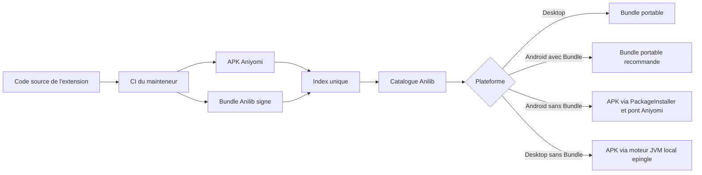

# Strategie des extensions Android et Desktop

Statut : implementation active ; phases 1, 2, 5 et 6 livrees, phase 4 utilisable,
validation externe de phase 3 en attente d'autorisation des mainteneurs

Date : 2026-08-19

## Decision en une phrase

Anilib presente **une seule extension logique dans un seul catalogue**. Le
Bundle Anilib signe reste le format natif recommande. Lorsqu'un depot ne publie
qu'un APK existant, Android utilise son adaptateur audite et Desktop le delegue
a un moteur JVM local, optionnel et isole.

Le moteur Desktop est une voie de compatibilite pragmatique, pas la nouvelle ABI
d'Anilib : son JAR est epingle par SHA-256, lance dans un processus separe sur
`127.0.0.1`, et projette ses sources en Bundles explicites. Une version portable
produite depuis le code source reste preferable pour la securite, le poids, la
reproductibilite et la maintenance.

## Problematique

L'utilisateur ne devrait pas avoir a comprendre la difference entre un depot
Aniyomi et un depot Anilib. Il veut ajouter une URL, trouver ses extensions,
les installer et retrouver les memes sources sur son telephone et son PC.

Le catalogue JSON d'Aniyomi ne contient toutefois que des metadonnees et des
liens. Son champ `apk` designe une application Android : le code est compile en
DEX, charge par Android Runtime et peut attendre des API Android, des classes
Aniyomi et des bibliotheques fournies par l'application hote. La documentation
officielle des extensions confirme notamment l'emploi de dependances
`compileOnly`, ce qui signifie que l'APK n'embarque pas necessairement tout ce
qu'il lui faut pour fonctionner.

Un PC ne peut donc pas executer directement cet APK comme un JAR. Changer
l'extension du fichier, extraire son archive ou convertir uniquement le DEX ne
recree ni Android Runtime ni l'ABI de l'application hote.

Il faut distinguer deux objectifs :

- conserver l'acces aux extensions Aniyomi existantes sur Android ;
- rendre la meme fonctionnalite de source executable nativement sur Android et
  Desktop.

Le premier objectif accepte un APK. Le second exige un artefact portable.

## Objectifs

- Une seule URL de depot et une seule liste d'extensions pour l'utilisateur.
- Une seule identite `pkg` et les memes identifiants numeriques de sources afin
  de conserver bibliotheque, historique et migrations.
- Une installation et des mises a jour compréhensibles sur chaque plateforme.
- Le meme comportement de source sur Android et Desktop lorsqu'un Bundle
  portable est disponible.
- La compatibilite avec les index Aniyomi existants, sans demander aux depots
  de casser leurs clients actuels.
- Un chemin simple pour publier plus tard des extensions exclusivement Anilib.
- La verification du code, de la provenance, des permissions et des mises a
  jour avant toute execution.

## Non-objectifs

- Promettre que n'importe quel APK ferme ou obfusque fonctionnera sur PC.
- Embarquer un emulateur Android complet dans l'application Desktop.
- Recreer l'ensemble d'Aniyomi et de ses dependances dans le coeur ou le
  classpath d'Anilib.
- Telecharger ou executer du code pendant la simple consultation d'un depot.
- Livrer, recommander ou republier un catalogue tiers sans choix de
  l'utilisateur et sans autorisation du mainteneur.
- Masquer une incompatibilite derriere un bouton d'installation qui ne peut pas
  aboutir.

## Options etudiees

| Option | APK existants | PC autonome | Maintenance | Poids et UX | Securite | Decision |
| --- | --- | --- | --- | --- | --- | --- |
| Emulateur Android integre | Bonne compatibilite potentielle | Oui | Tres elevee | Tres lourd, virtualisation et demarrage lent | Grande surface d'attaque | Rejete |
| Conversion DEX vers JVM chargee dans Anilib | Partielle et imprevisible | Oui | Extreme a chaque changement d'ABI | Invisible si elle marche, erreurs difficiles sinon | Compromet le processus hote | Rejete |
| Moteur JVM APK en processus local | Bonne pour les API implementees | Oui | Porte par un composant isole | Demarrage et memoire supplementaires | Code tiers hors processus, boucle locale et hash epingle | **Retenu comme compatibilite** |
| Telephone utilise comme relais pour le PC | Bonne sur Android | Non, telephone obligatoire | Elevee | Appairage, latence et indisponibilite hors ligne | Nouveau protocole distant sensible | Secours eventuel, pas cible principale |
| Reecriture manuelle de chaque extension | Oui apres portage | Oui | Elevee par extension | Bonne a l'execution | Maitrisable | Utile pour les cas complexes |
| Double publication depuis le code source | Oui sur Android, puis portable partout | Oui | Raisonnable et testable | Native et legere | Compatible avec la signature et les permissions Anilib | **Retenu** |

## Pourquoi la double publication est le meilleur choix

### Elle resout le vrai besoin

L'objectif n'est pas de faire croire a Windows qu'un APK est une application
Windows. L'objectif est d'executer la meme logique de catalogue, de recherche,
de lecture ou de streaming sur les deux appareils. Deux sorties construites
depuis la meme source atteignent cet objectif sans imposer le meme format
binaire a des systemes incompatibles.

### Elle reste native

Le Bundle Anilib s'execute directement dans le modele de modules de l'application.
Il n'ajoute ni machine virtuelle Android complete, ni processus d'emulation, ni
image systeme de plusieurs gigaoctets. Le lancement, la memoire, les mises a
jour et les diagnostics restent ceux d'une application Desktop normale.

### Elle est testable

Le producteur peut compiler et tester l'APK et le Bundle dans la meme CI. Une
extension incompatible echoue au build ou dans des fixtures de contrat, plutot
que chez l'utilisateur apres une conversion opaque du bytecode.

### Elle preserve l'architecture Anilib

Le Bundle portable utilise la Source API publique, un descripteur explicite, des
origines reseau declarees et le graphe unique de Bundles. Il n'introduit pas de
scan de classpath, de classes `eu.kanade.*` dans le runtime portable ou de
dependance Android dans les fonctionnalites partagees.

### Elle permet une transition progressive

Un depot peut continuer a publier ses APK pour Aniyomi tout en ajoutant un champ
`anilib`. Les anciens clients ignorent ce champ. Anilib utilise immediatement le
Bundle sur PC et peut le preferer aussi sur Android. Les extensions non encore
portees restent disponibles sur Android et via le moteur Desktop optionnel.

## Architecture cible



### Identite logique unique

Une carte d'extension correspond a un `pkg`, pas a un fichier. Elle peut
annoncer :

- un artefact `apk`, natif Android et executable sur Desktop via le sidecar ;
- un artefact `anilib`, compatible Android et Desktop ;
- les deux pendant la migration ;
- uniquement `anilib` pour une future extension native Anilib.

Le nom, l'icone, la langue, le type de media, les identifiants de sources et
l'etat epingle restent communs. L'interface ne doit jamais creer deux cartes
pour les deux artefacts.

### Regle de selection

| Plateforme | Bundle Anilib present | APK present | Resultat |
| --- | --- | --- | --- |
| Android | Oui | Oui ou non | Installer le Bundle portable par defaut |
| Android | Non | Oui | Proposer l'APK avec avertissement de compatibilite |
| Desktop | Oui | Oui ou non | Installer le Bundle portable |
| Desktop | Non | Oui | Installer dans le moteur local s'il est configure ; sinon expliquer la configuration requise |
| Toute plateforme | Non | Non | Entree invalide, rejetee au chargement de l'index |

Android doit permettre un choix avance de l'APK seulement si un mainteneur
signale une difference fonctionnelle connue. Le choix par defaut reste le
Bundle, afin que les deux appareils executent le meme code et recoivent les
memes correctifs.

## Fabrique de portabilite depuis les sources

La migration d'une extension Aniyomi doit etre un travail de build reproductible,
pas une transformation effectuee sur l'appareil de l'utilisateur.

### Entrees

- le depot source et sa revision exacte ;
- la licence et l'autorisation de redistribution ;
- l'identite `pkg`, les identifiants de sources et la version amont ;
- la liste des origines reseau necessaires ;
- les fixtures de reponses publiques ou synthetiques utilisees pour les tests.

### Etapes

1. **Analyser** les imports et fonctions utilises par l'extension.
2. **Produire un rapport de compatibilite** : portable automatiquement,
   adaptation manuelle requise ou Android uniquement.
3. **Extraire la logique partageable** de requetes, parsing et mapping dans un
   noyau sans type Android.
4. **Conserver l'adaptateur Aniyomi** qui produit l'APK.
5. **Ajouter un adaptateur Anilib** qui implemente la Source API et utilise
   uniquement le `SourceExtensionContext` accorde.
6. **Tester les deux sorties** contre les memes fixtures fonctionnelles.
7. **Construire, hacher et signer** le Bundle avec la cle du mainteneur.
8. **Publier les deux artefacts** sous la meme entree d'index.

L'outil Anilib a creer ne doit pas promettre une traduction universelle de
Kotlin/Android vers Java. Il doit surtout automatiser l'inventaire, generer le
squelette d'adaptation, verifier les identites et permissions, lancer les tests
de contrat et publier le Bundle. Les extensions simples fondees sur HTTP et le
parsing demanderont peu d'adaptation ; les extensions utilisant WebView,
services Android, code natif, torrent ou API privees resteront manuelles ou
Android uniquement.

## Format de depot

Le format actuel est deja compatible avec la transition : l'entree conserve le
champ Aniyomi `apk` et peut ajouter un objet `anilib` ignore par les anciens
clients.

```json
{
  "name": "Example",
  "pkg": "org.example.extension",
  "apk": "apk/example.apk",
  "lang": "fr",
  "code": 12,
  "version": "14.12",
  "nsfw": 0,
  "anilib": {
    "bundle": "bundle/example.jar",
    "api": "1.7",
    "sha256": "SHA256_HEXADECIMAL",
    "signature": "SIGNATURE_ED25519_BASE64",
    "keyId": "publisher-key",
    "kind": "anime"
  },
  "sources": [
    {
      "name": "Example",
      "lang": "fr",
      "id": "123456789",
      "baseUrl": "https://example.org"
    }
  ]
}
```

Une evolution ulterieure du schema pourra donner un `versionCode`, un checksum
et un changelog propres a chaque artefact. Elle devra rester retrocompatible
avec les index Aniyomi actuels.

## Modele de confiance

### APK Android

- Telechargement HTTPS avec validation de chaque redirection.
- Installation finale geree par `PackageInstaller` et confirmee par Android.
- Affichage puis approbation explicite de l'empreinte complete du certificat.
- Invalidation de la confiance si le signataire change.
- Preflight de l'ABI avant chargement et nouvel examen du signataire a chaque
  operation.

### Bundle portable

- SHA-256 et signature Ed25519 obligatoires.
- Cle publique du mainteneur importee explicitement par l'utilisateur.
- Descripteur, identite, version, API, module, factories et origines verifies.
- Module enfant ferme, permissions reseau limitees aux origines declarees.
- Activation ou mise a jour au prochain redemarrage, sans mutation du graphe en
  cours d'execution.

Le catalogue ne constitue jamais une preuve de confiance. La confiance porte
sur l'artefact exact et son editeur.

## Experience utilisateur cible

Chaque carte doit afficher des badges simples :

- `Android + PC` lorsqu'un Bundle portable existe ;
- `Android` lorsque seul un APK existe ;
- `Aniyomi APK` ou `Anilib Bundle` dans le detail technique, pas comme titre
  principal de l'extension.

Les actions suivent la plateforme :

- `Installer` pour un Bundle compatible avec l'appareil courant ;
- `Installer l'APK sur Android` pour le secours APK ;
- `Installer sur Desktop` lorsque le moteur local verifie est disponible ;
- une explication et, si elle existe, un lien vers la demande de portage ;
- un seul etat epingle, une seule fiche et une seule position dans la liste.

Le detail doit montrer la disponibilite par plateforme, l'editeur, la cle ou le
certificat, la version, les permissions, le resultat de compatibilite et la
raison exacte d'un blocage.

## Plan d'implementation

### Phase 1 - Unifier le modele produit

- [x] Formaliser `pkg` comme identite de l'extension et l'artefact comme variante.
- [x] Conserver une seule carte lorsqu'une entree contient APK et Bundle.
- [x] Preferer le Bundle sur Android et Desktop.
- [x] Afficher clairement la matrice de disponibilite.
- [x] Tester les cas APK seul, Bundle seul, double artefact et entree invalide.

### Phase 2 - Creer l'assistant de portage

- [x] Ajouter une commande d'analyse d'un depot source Aniyomi.
- [x] Detecter imports Android, ABI Aniyomi, bibliotheques `compileOnly`, code natif,
  WebView, preferences, torrent et acces directs au reseau ou au stockage.
- [x] Produire un rapport machine-readable et lisible par un mainteneur.
- [x] Generer un module Anilib initial qui conserve `pkg` et les IDs de sources.
- [x] Ne jamais modifier ni publier automatiquement le depot tiers.

### Phase 3 - Valider sur des extensions de reference

- [ ] Choisir avec autorisation plusieurs extensions : anime simple, manga simple,
  filtres, preferences et streaming multi-hebergeur.
- [ ] Construire APK et Bundle depuis une revision unique.
- [ ] Executer les memes fixtures sur Android, Windows, Linux et macOS.
- [ ] Mesurer le travail manuel restant et corriger l'outil avant generalisation.

### Phase 4 - Industrialiser la publication

- [x] Etendre `SourcePublisher` pour produire une entree a deux artefacts.
- [x] Fournir une CI reutilisable aux mainteneurs externes.
- [x] Signer avec la cle du mainteneur, jamais avec une cle generale d'Anilib.
- [x] Publier index complet/minifie, artefacts et checksums.
- [x] Produire separement les rapports JSON et Markdown de compatibilite.
- [ ] Relier chaque rapport de compatibilite a son entree d'index.
- [ ] Refuser une publication si les IDs, versions ou permissions de l'APK
  divergent de ceux du Bundle sans
  migration explicite.

### Phase 5 - Ecosysteme Anilib natif

- [x] Documenter le template de nouvelle extension portable.
- [x] Permettre une extension Anilib sans APK.
- [x] Conserver exactement le meme catalogue, les memes ecrans et le meme mecanisme
  de confiance.
- [x] Encourager les mainteneurs a partager un noyau de logique entre adaptateurs
  plutot qu'a maintenir deux scrapers independants.

### Phase 6 - Compatibilite APK Desktop sans cooperation des mainteneurs

- [x] Integrer le moteur existant comme sidecar optionnel au lieu de charger son
  ABI et ses dependances dans Anilib.
- [x] Exiger un JAR local non symbolique et son SHA-256 exact avant lancement.
- [x] Executer une copie jetable avec un environnement reduit sur `127.0.0.1` et
  fermer le processus avec l'application.
- [x] Synchroniser les depots utilisateur et installer leurs APK HTTPS depuis
  l'ecran d'extensions Desktop.
- [x] Mapper populaire, recentes, recherche, chapitres/pages, episodes, videos,
  sous-titres, HLS et DASH vers la Source API partagee.
- [x] Garder images et medias authentifies derriere le relais loopback afin que
  cookies et en-tetes restent possedes par le moteur de source.
- [x] Tester le protocole complet avec un faux moteur deterministe sans catalogue
  ni artefact tiers dans le depot Anilib.
- [ ] Executer des APK publics representatifs sur les produits packages et
  documenter chaque classe d'incompatibilite restante.

## Utilisation de l'assistant livre

La commande suivante analyse une copie locale en lecture seule, ecrit les deux
rapports et cree un module initial dans un dossier vide :

```powershell
.\gradlew.bat :Anilib:Tooling:ExtensionPortability:run --args="analyze C:\sources\extension --package publisher.pkg --source-ids 123,456 --output build\portability --scaffold build\ported-module --kind anime --lang fr"
```

Sans les options `--package` et `--source-ids`, l'outil tente de les detecter
dans le depot. Les valeurs explicites restent necessaires si le build amont les
calcule dynamiquement. L'outil ne clone, ne modifie et ne publie jamais le depot
analyse.

## Criteres d'acceptation

La strategie est consideree livree lorsque :

- une URL de depot affiche une seule fiche par `pkg` ;
- une extension double artefact s'installe comme Bundle sur Android et Desktop ;
- une extension APK seule reste installable sur Android et sur Desktop sans
  moteur tiers a configurer ;
- bibliotheque, historique, favoris et migration conservent les memes IDs de
  sources entre APK et Bundle ;
- une mise a jour ne peut pas changer silencieusement d'editeur ;
- aucun APK, DEX ou code de catalogue n'est execute pendant la decouverte ;
- les tests de contrat passent sur Android, Windows, Linux et macOS ;
- l'application n'embarque pas d'emulateur Android ; l'ABI de compatibilite
  reste confinee au module de plateforme `DesktopExtensionHost`.

## Risques restant a assumer

- Toutes les extensions Aniyomi ne seront pas portables immediatement.
- Un site peut changer plus vite que les deux artefacts ne sont publies.
- Certaines dependances Android n'ont pas d'equivalent Desktop raisonnable.
- Un mainteneur peut refuser la redistribution ou ne pas publier son code.
- Un Bundle signe reste du code tiers ; JPMS et les permissions reduisent sa
  portee mais ne constituent pas une sandbox de securite parfaite.

Ces limites doivent etre visibles. Une compatibilite honnete et progressive est
preferable a une promesse « tous les APK fonctionnent » impossible a garantir.

## Conclusion

La meilleure solution combine **un catalogue unifie, un Bundle natif recommande
et l'hote APK Desktop d'Anilib**. Anilib peut ainsi utiliser immediatement les
depots existants sans attendre leurs mainteneurs, tout en conservant une voie
plus legere, signee et reproductible pour les sources Anilib natives.

La conversion et l'ABI de compatibilite restent moins fiables qu'un Bundle natif.
Elles sont donc confinees a l'adaptateur de plateforme, jamais fusionnees au
Kernel ou aux Features. Le portage au moment du build reste la cible de qualite ;
l'hote integre couvre le besoin immediat sans intervention des mainteneurs.

## References

- [Architecture Anilib](ARCHITECTURE.md)
- [Modele actuel du depot d'extensions](Features/ExtensionRepository/README.md)
- [Template officiel d'une source portable Anilib](Examples/SourceTemplate/README.md)
- [Depot officiel Aniyomi](https://github.com/aniyomiorg/aniyomi)
- [Guide officiel de creation des extensions Aniyomi](https://github.com/aniyomiorg/aniyomi-extensions/blob/master/CONTRIBUTING.md)
- [Depot historique officiel des extensions Aniyomi](https://github.com/aniyomiorg/aniyomi-extensions)
